  

  

  Backend-focused engineer building reliable and scalable applications.
   
  Interested in system design, cloud infrastructure, databases and distributed systems.

 

<h3 align="center">Tech Stack</h3>

  

  

  
  
  
  
  
  

  
  
  
  
  
  

 

<h3 align="center">Engineering Focus</h3>

  Backend Development
  &nbsp;•&nbsp;
  API Design
  &nbsp;•&nbsp;
  System Design
  &nbsp;•&nbsp;
  Cloud Infrastructure
  &nbsp;•&nbsp;
  Database Design
  &nbsp;•&nbsp;
  Integrations

 

<h3 align="center">GitHub Activity</h3>

  

 

  

  

